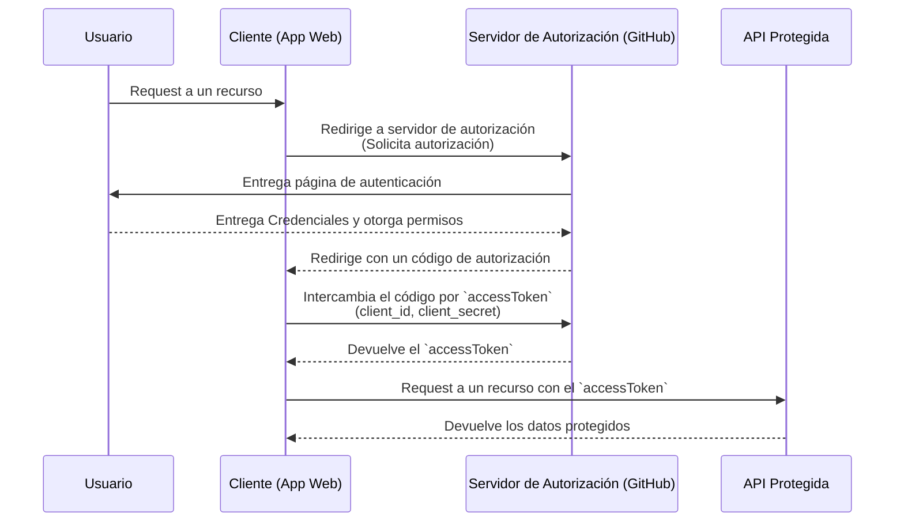

# Fireship Deno App

## Funcionamiento de OAuth2 con GitHub

Diagrama generado con chatgpt, hay que actualizarlo para que coincida con el código.

```mermaid
sequenceDiagram
    participant User as Usuario
    participant Client as Cliente (App Web)
    participant GitHub as Servidor de Autorización (GitHub)
    participant API as API Protegida

    %% Usuario no autenticado
    User   ->>  Client: Request a un recurso
    Client ->>  GitHub: Redirige a servidor de autorización<br>(Solicita autorización)
    GitHub ->>  User:   Entrega página de autenticación
    User   -->> GitHub: Entrega Credenciales y otorga permisos
    GitHub -->> Client: Redirige con un código de autorización
    Client ->>  GitHub: Intercambia el código por `accessToken`<br>(client_id, client_secret)
    GitHub -->> Client: Devuelve el `accessToken`
    
    %% Usuario autenticado
    Client ->>  API:    Request a un recurso con el `accessToken`
    API    -->> Client: Devuelve los datos protegidos
```